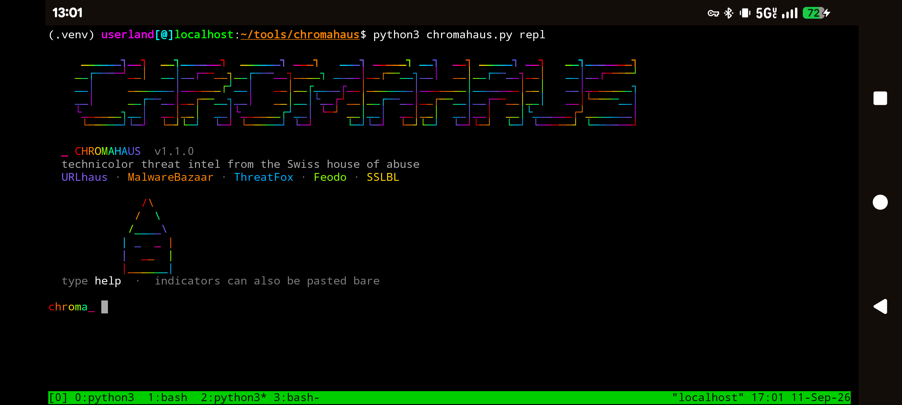
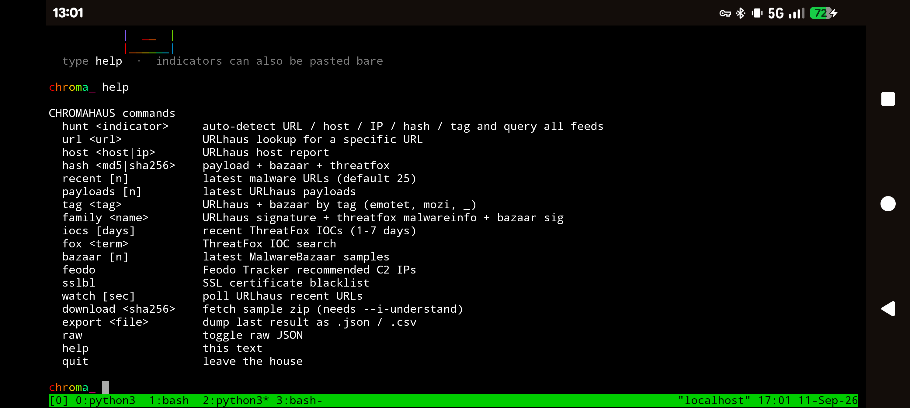
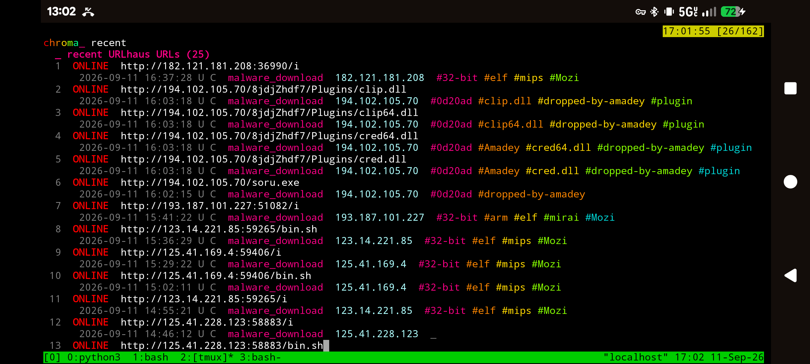

# CHROMAHAUS

```
   ██████╗██╗  ██╗██████╗  ██████╗ ███╗   ███╗ █████╗ ██╗  ██╗ █████╗ ██╗   ██╗███████╗
  ██╔════╝██║  ██║██╔══██╗██╔═══██╗████╗ ████║██╔══██╗██║  ██║██╔══██╗██║   ██║██╔════╝
  ██║     ███████║██████╔╝██║   ██║██╔████╔██║███████║███████║███████║██║   ██║███████╗
  ██║     ██╔══██║██╔══██╗██║   ██║██║╚██╔╝██║██╔══██║██╔══██║██╔══██║██║   ██║╚════██║
  ╚██████╗██║  ██║██║  ██║╚██████╔╝██║ ╚═╝ ██║██║  ██║██║  ██║██║  ██║╚██████╔╝███████║
   ╚═════╝╚═╝  ╚═╝╚═╝  ╚═╝ ╚═════╝ ╚═╝     ╚═╝╚═╝  ╚═╝╚═╝  ╚═╝╚═╝  ╚═╝ ╚═════╝ ╚══════╝
```

**Technicolor threat intel from the Swiss house of abuse.**

A single-file Python 3 CLI for the [abuse.ch](https://abuse.ch/) community APIs. Query reported malware URLs, hosts, hashes, families, IOCs, botnet C2s, and SSL certs — then paint the results across a terminal that refuses to be beige.

```
URLhaus · MalwareBazaar · ThreatFox · Feodo Tracker · SSLBL
```

---
### Basic Preview


---



---



---

## Why this exists

abuse.ch runs some of the most useful *free* malware-intel platforms on the internet:

| Platform | What you get |
|---|---|
| [URLhaus](https://urlhaus.abuse.ch/) | URLs used to distribute malware |
| [MalwareBazaar](https://bazaar.abuse.ch/) | Sample metadata (and optional zipped samples) |
| [ThreatFox](https://threatfox.abuse.ch/) | Shared indicators of compromise |
| [Feodo Tracker](https://feodotracker.abuse.ch/) | Botnet C2 IP blocklists |
| [SSLBL](https://sslbl.abuse.ch/) | Malicious SSL certificates / JA3 |

CHROMAHAUS wraps those APIs in one script: interactive shell *and* one-shot commands, auto-detecting indicator type, color-coding status, and exporting whatever you just pulled.

This is a **threat-intelligence viewer**. It is not a malware runner, unpacker, or sandbox.

---

## Features

- Zero third-party dependencies (Python 3 stdlib only)
- Interactive REPL plus a full argparse CLI
- `hunt` auto-detects URL / host / IPv4 / hash / tag and fans out across feeds
- Color-coded online / offline badges, family names, confidence scores, rainbow tags
- Live `watch` mode that polls URLhaus for newly reported URLs
- Export last listing to `.json` or `.csv`
- Raw JSON mode for piping into `jq`
- Auth-Key from flag, env var, or a key file
- Sample download is **opt-in and warned** — will not fetch binaries unless you mean it

---

## Requirements

- Python **3.9+** (3.10+ recommended)
- Network access to `*.abuse.ch`
- A free abuse.ch **Auth-Key**

No `pip install`. No virtualenv required.

```bash
python3 --version
```

---

## Authentication

As of mid-2025, abuse.ch requires an Auth-Key on community API calls. Keys are free.

1. Create an account at **[https://auth.abuse.ch/](https://auth.abuse.ch/)**
2. Generate an Auth-Key in your profile and save it
3. Feed it to CHROMAHAUS using any of these (first match wins):

```bash
# 1. environment variable (recommended)
export ABUSECH_AUTH_KEY='your-key-here'

# 2. CLI flag
python3 chromahaus.py --key 'your-key-here' recent

# 3. key file (pick one)
mkdir -p ~/.config/chromahaus
echo 'your-key-here' > ~/.config/chromahaus/auth.key
chmod 600 ~/.config/chromahaus/auth.key

# also accepted:
#   ~/.chromahaus.key
#   ./.chromahaus.key
```

`$ABUSE_CH_KEY` is accepted as an alias for `$ABUSECH_AUTH_KEY`.

Treat the key like a password. Do not commit it. Do not paste it into screenshots of your prompt history.

---

## Quick start

```bash
chmod +x chromahaus.py

export ABUSECH_AUTH_KEY='your-key-here'

# drop into the interactive house
python3 chromahaus.py

# or fire a one-shot query
python3 chromahaus.py recent -n 20
python3 chromahaus.py hunt http://example.invalid/payload.exe
```

`NO_COLOR=1` or `--no-color` disables ANSI if you are piping output or your terminal hates vibes.

---

## Commands

### CLI

```
python3 chromahaus.py [--key KEY] [--no-color] [--json] [--out FILE] [-n LIMIT] <command>
```

| Command | What it does |
|---|---|
| *(no command)* / `repl` | Interactive shell |
| `hunt <indicator>` | Auto-detect type and query every relevant feed |
| `url <url>` | URLhaus lookup for one URL |
| `host <host\|ip>` | URLhaus host report + URLs on that host |
| `hash <md5\|sha1\|sha256>` | URLhaus payload + MalwareBazaar + ThreatFox |
| `recent` | Latest malware URLs (cap with `-n`) |
| `payloads` | Latest URLhaus payloads |
| `tag <tag>` | URLhaus + Bazaar by tag (`mozi`, `emotet`, …) |
| `family <name>` | Signature / family across URLhaus, ThreatFox, Bazaar |
| `iocs [--days 1-7]` | Recent ThreatFox IOCs |
| `fox <term>` | ThreatFox IOC search |
| `bazaar` | Latest MalwareBazaar samples |
| `feodo` | Feodo Tracker recommended C2 IPs |
| `sslbl` | SSL certificate blacklist |
| `watch [--interval SEC]` | Poll URLhaus for newly reported URLs |
| `download <sha256>` | Fetch a sample zip (**dangerous**, see below) |

Global flags:

| Flag | Meaning |
|---|---|
| `--key KEY` | Auth-Key for this run |
| `--no-color` | Strip ANSI |
| `--json` | Dump raw API JSON instead of the pretty view |
| `--out FILE` | Write the last listing to `.json` or `.csv` |
| `-n / --limit` | Row cap for list commands (default `25`) |
| `-V / --version` | Print version and exit |

### Interactive shell

Launch with `python3 chromahaus.py`, then:

```
hunt <indicator>
url <url>
host <host|ip>
hash <digest>
recent [n]
payloads [n]
tag <tag>
family <name>
iocs [days]
fox <term>
bazaar [n]
feodo
sslbl
watch [sec]
download <sha256>          # still refuses without --i-understand on the CLI
export hits.csv            # or hits.json
raw                        # toggle raw JSON
help
quit
```

Bare indicators work too. Paste a URL, hash, or IP and CHROMAHAUS will `hunt` it.

---

## Examples

```bash
# latest reported malware URLs
python3 chromahaus.py recent -n 15

# one URL
python3 chromahaus.py url 'http://45.61.49.78/razor/r4z0r.mips'

# everything we know about a host
python3 chromahaus.py hunt 45.61.49.78

# hash across three platforms
python3 chromahaus.py hash 0c415dd718e3b3728707d579cf8214f54c2942e964975a5f925e0b82fea644b4

# family / signature sweep
python3 chromahaus.py family TrickBot
python3 chromahaus.py tag mozi

# ThreatFox
python3 chromahaus.py iocs --days 3
python3 chromahaus.py fox 139.180.203.104

# live feed (Ctrl-C to stop)
python3 chromahaus.py watch --interval 45

# machine-readable
python3 chromahaus.py --json recent -n 10
python3 chromahaus.py recent -n 100 --out urlhaus.json
python3 chromahaus.py bazaar -n 50 --out samples.csv
```

---

## Sample downloads

`download` talks to URLhaus first, then falls back to MalwareBazaar `get_file`.

```bash
python3 chromahaus.py download <sha256> --dest ./quarantine --i-understand
```

Without `--i-understand` the command **refuses**. That is intentional.

- Samples are **live malware**
- Archives are typically ZIP-passworded with `infected`
- Never open or execute them on a machine you care about
- Isolated VM, no shared folders, snapshot first, network off if you do not need it
- abuse.ch also enforces daily download limits

CHROMAHAUS will not unpack the zip and will not execute anything inside it.

---

## Indicator detection (`hunt`)

| Looks like | Treated as | Feeds queried |
|---|---|---|
| `http://…` / `https://…` | URL | URLhaus URL + ThreatFox search |
| 32 / 40 / 64 hex chars | Hash | URLhaus payload + Bazaar `get_info` + ThreatFox `search_hash` |
| IPv4 (`[:port]` ok) | Host / IP | URLhaus host + ThreatFox search |
| Domain-shaped string | Host | Same as IP |
| Anything else | Term | URLhaus tag + ThreatFox search + Bazaar tag |

---

## Colors

Status and scores are painted when stdout is a TTY:

| Thing | Color language |
|---|---|
| `online` / listed | loud red |
| `offline` / no results | dim gray |
| malware families | gold |
| tags | rotating rainbow chips |
| ThreatFox confidence ≥ 90 | neon green |
| ThreatFox confidence ≥ 50 | gold |
| hashes | mint |
| errors | red, obviously |

Disable with `--no-color` or `NO_COLOR=1`.

---

## Exit codes

| Code | Meaning |
|---|---|
| `0` | ok |
| `1` | API / network / download failure |
| `2` | no Auth-Key configured |

---

## API notes

Official docs, if you want to go deeper than the wrapper:

- URLhaus API — https://urlhaus-api.abuse.ch/
- MalwareBazaar API — https://bazaar.abuse.ch/api/
- ThreatFox API — https://threatfox.abuse.ch/api/
- Auth portal — https://auth.abuse.ch/
- Sample scripts from abuse.ch — https://github.com/abusech

Rate limits exist and are enforced. If you get `429`, back off. Do not hammer `watch` below ~15 seconds; the client already floors the interval there.

Fair-use still applies. This client is for research, hunting, and blocking — not for scraping the entire lake on a cron every five seconds.

---

## Disclaimer

CHROMAHAUS talks to public threat-intelligence APIs that catalog *reported* malicious infrastructure.

- Hits mean “someone reported this to abuse.ch,” not a courtroom verdict
- Misses mean “not in these datasets,” not “safe”
- Downloaded samples can wreck a host
- You are responsible for how you use the data and any files you choose to retrieve
- Respect abuse.ch submission policy and terms; do not report junk

Stay curious. Stay careful. Do not become the incident.

---

## License

Use it, fork it, paint it a different gradient. Credit [abuse.ch](https://abuse.ch/) for the data — they do the actual work.

---

```
            /\
           /  \
          /_██_\
         | ■  ■ |
         |  ▄▄  |
         |__██__|

         chroma⌂
```
